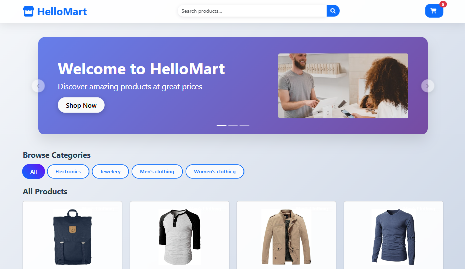
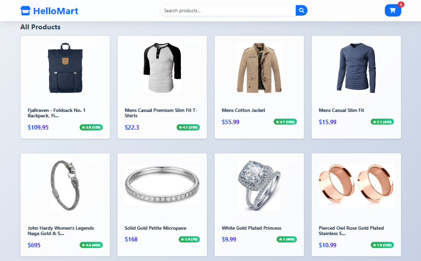
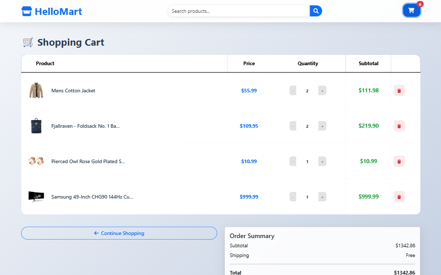
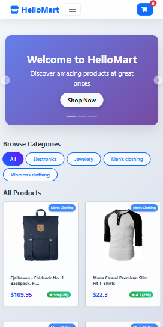
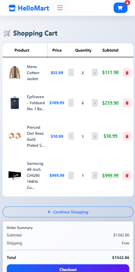

# HelloMart - Modern E-commerce Website

A modern, responsive e-commerce website built with React and Bootstrap, featuring a clean UI with glass morphism effects and smooth animations.

## 📸 Screenshots

### Desktop View




### Mobile View



## 🚀 Features

- **Modern UI Design**: Glass morphism effects, gradient backgrounds, and smooth animations
- **Responsive Layout**: Optimized for mobile, tablet, and desktop devices
- **Product Catalog**: Browse products by categories with pagination
- **Search Functionality**: Real-time product search with filtering
- **Shopping Cart**: Add/remove items, quantity management, persistent storage
- **Checkout Process**: Complete order flow with form validation
- **Interactive Carousel**: Hero section with navigation buttons

## 🛠️ Technologies Used

- **Frontend**: React 18, React Router DOM
- **Styling**: Bootstrap 5, Custom CSS with modern effects
- **Icons**: Font Awesome
- **API**: Fake Store API for product data
- **Storage**: Local Storage for cart persistence

## 📦 Installation

1. Clone the repository:
```bash
git clone https://github.com/yourusername/e-commerce.git
cd e-commerce
```

2. Install dependencies:
```bash
npm install
```

3. Start the development server:
```bash
npm start
```

4. Open [http://localhost:3000](http://localhost:3000) in your browser

## 🏗️ Project Structure

```
src/
├── components/
│   ├── Navbar.js          # Navigation bar with search
│   ├── ProductCard.js     # Product display card
│   └── Toast.js           # Notification component
├── pages/
│   ├── Home.js            # Homepage with carousel and products
│   ├── Cart.js            # Shopping cart page
│   ├── Checkout.js        # Checkout form page
│   ├── ProductDetail.js   # Individual product page
│   └── SearchPage.js      # Search results page
├── App.js                 # Main app component
├── App.css               # Custom styles and animations
└── index.js              # App entry point
```

## 🎨 Design Features

- **Glass Morphism**: Semi-transparent cards with backdrop blur
- **Gradient Backgrounds**: Modern color schemes throughout
- **Hover Animations**: Smooth transitions and transforms
- **Responsive Grid**: Adaptive layout for all screen sizes
- **Modern Typography**: Clean, readable font hierarchy

## 📱 Responsive Breakpoints

- **Mobile**: < 768px (2 columns product grid)
- **Tablet**: 768px - 992px (3 columns product grid)
- **Desktop**: > 992px (4 columns product grid)

## 🛒 Cart Features

- Persistent storage using localStorage
- Real-time cart count in navbar
- Quantity management (increase/decrease)
- Item removal functionality
- Order summary with totals

## 🔧 Available Scripts

- `npm start` - Run development server
- `npm build` - Build for production
- `npm test` - Run test suite
- `npm eject` - Eject from Create React App

## 🌐 API Integration

Uses [Fake Store API](https://fakestoreapi.com/) for:
- Product listings
- Product categories
- Individual product details
- Product images and descriptions

## 📄 License

This project is open source and available under the [MIT License](LICENSE).

## 🤝 Contributing

1. Fork the repository
2. Create a feature branch (`git checkout -b feature/AmazingFeature`)
3. Commit your changes (`git commit -m 'Add some AmazingFeature'`)
4. Push to the branch (`git push origin feature/AmazingFeature`)
5. Open a Pull Request

## 📞 Support

For support, email support@hellomart.com or create an issue in this repository.

---

Made with ❤️ using React and Bootstrap